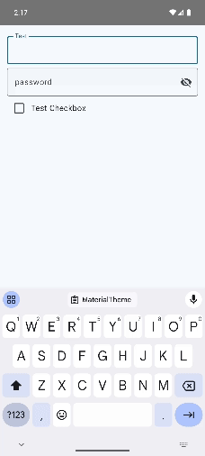

# Formz


## Formz form validation in library for Android
This library is designed to simplify the process of validating form in simplify way.

[](https://jitpack.io/#ChochaNaresh/Formz)
[](https://android-arsenal.com/api?level=21)


## GIF


## inspire from
inspire from **Very Good Ventures** 🦄
from flutter package
[formz](https://pub.dev/packages/formz)

### How to use
**How to add dependencies**

**Groovy**
```groovy
dependencyResolutionManagement {
		repositoriesMode.set(RepositoriesMode.FAIL_ON_PROJECT_REPOS)
		repositories {
			mavenCentral() // // For Formz library, this line is enough. Although, it has been published on jitpack as well
			maven { url 'https://jitpack.io' } // //Make sure to add this in your project
		}
	}
```

```groovy
dependencies {
    // ...
    implementation 'com.github.ChochaNaresh:Formz:$libVersion'
    // ...
}
```

**kts**
```kotlin
dependencyResolutionManagement {
    repositoriesMode.set(RepositoriesMode.FAIL_ON_PROJECT_REPOS)
    repositories {
        google()
        mavenCentral() // For Formz library, this line is enough. Although, it has been published on jitpack as well
        maven { setUrl("https://jitpack.io") }  //Make sure to add this in your project
    }
}
```

```kotlin
dependencies {
    // ...
    implementation("com.github.ChochaNaresh:Formz:$libVersion")
    // ...
}
```
## Version
Where `$libVersion` = [](https://jitpack.io/#ChochaNaresh/Formz)

## Create a FormzInput
```kotlin
import com.nareshchocha.formz.FormzInput

enum class NameInputError { Empty }


class NameInput(
    value: String = "",
    isPure: Boolean = true
) : FormzInput<String, NameInputError>(value, isPure) {
    override fun validator(value: String): NameInputError? {
        return if (value.isEmpty()) NameInputError.Empty else null
    }

    fun copy(value: String, isPure: Boolean = false): NameInput {
        return NameInput(value, isPure = isPure)
    }
}
```
## Interact with a FormzInput
```kotlin
val name = NameInput()
println(name.value) // ''
println(name.isValid) // false
println(name.error) // NameInputError.empty
println(name.displayError) // null

val joe = NameInput(value = "joe")
println(joe.value) // 'joe'
println(joe.isValid) // true
println(joe.error) // null
println(joe.displayError) // null
```
## Validate Multiple FormzInput Items
```kotlin
val validInputs = listOf(
    NameInput(value = "jan", false),
    NameInput(value = "jen", false),
    NameInput(value = "joe", false)
)

println(Formz.validate(validInputs)) // true

val invalidInputs = listOf(
    NameInput(isPure=false),
    NameInput(isPure=false),
    NameInput(isPure=false)
)

println(Formz.validate(invalidInputs)) // false
```
## Automatic Validation

```kotlin
class LoginFormState(   
    val username : Username = Username(isPure = true),
    val password : Password = Password(isPure = true)
) : FormzInterface {
    
    override val inputs: List<FormzInput<*, *>> = listOf(username, password)

}
```
## Compatibility
* Library - Android Lollipop 5.0+ (API 21)
* Sample - Android Lollipop 5.0+ (API 21)
## Contributing

Contributions are always welcome!
## Support

For support, email  chochanaresh0@gmail.com or join our Slack channel.

[](https://www.buymeacoffee.com/chochanaresh)

## License
```text
Copyright 2023 Naresh chocha

Licensed under the Apache License, Version 2.0 (the "License");
you may not use this file except in compliance with the License.
You may obtain a copy of the License at
    
http://www.apache.org/licenses/LICENSE-2.0
    
Unless required by applicable law or agreed to in writing, software
distributed under the License is distributed on an "AS IS" BASIS,
WITHOUT WARRANTIES OR CONDITIONS OF ANY KIND, either express or implied.
See the License for the specific language governing permissions and
limitations under the License.
```